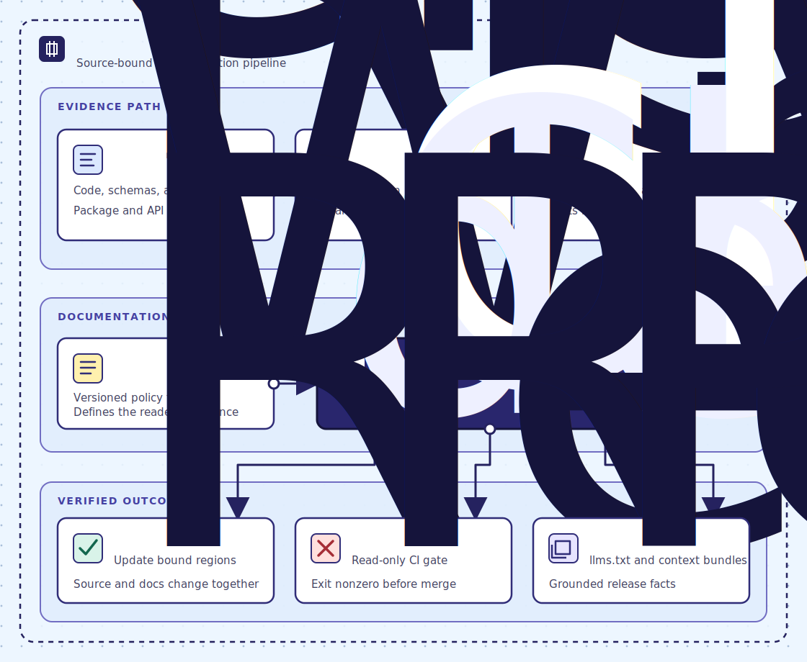

# clean-docs

<!-- clean-docs:policy register-v2 -->
<!-- clean-docs:purpose -->
clean-docs is a source-bound documentation engine and CLI for maintainers who need code and prose to change together. It turns selected source facts into checked documentation, so stale claims fail in local workflows and CI.
<!-- clean-docs:end purpose -->

[](https://github.com/owieschon/clean-docs/actions/workflows/ci.yml) [](https://github.com/owieschon/clean-docs/releases/latest) [](LICENSE)

**[Install the stable release and catch your first stale claim](docs/learn/tutorial-catch-a-lying-doc.md)**.

The final `clean-docs verify` command prints a [`clean-docs.outcome.v2` receipt](docs/SUPPORT.md#record-local-outcomes) with `"ok": true`.

Audit starts from the document's job. On an untouched repository it is an assessment: broken links,
machine-specific residue, and repository-neutral corpus signals remain bounded advisories. Run
`clean-docs audit --preview-policy` to add compatible house-policy candidates without accepting
them as gates. A manifest accepts repository integrity checks as gates; a policy marker accepts
compatible writing rules for one document. Neither makes an incompatible rule applicable or
authorizes clean-docs to flatten repository-native forms.

| If you need to... | Start with | You will leave with... |
| --- | --- | --- |
| Try the repair loop | [Runnable tutorial](docs/learn/tutorial-catch-a-lying-doc.md) | A failed drift check and a repaired page |
| Choose a command | [CLI reference](docs/CLI.md) | The command and its write boundary |
| Configure a binding | [Manifest reference](docs/REFERENCE.md) | A source-bound fact with the right depth |
| Investigate an unbound count or column claim | [Source claim checks](docs/REFERENCE.md#source-claim-checks) | A ranked candidate or accepted deterministic relationship |
| Review a pull request | [Coverage-stating verdict](docs/CLI.md#pull-request-verdicts) | One pinned state with gaps, skips, and non-claims visible |
| Understand trust boundaries | [Security model](docs/SECURITY_MODEL.md) | The process and host guarantees |

## Why clean-docs exists

<!-- clean-docs:begin product-overview -->
A stale sentence does not fail loudly. It keeps a straight face after the code has moved on, and reviewers have no mechanical way to identify the false claim. clean-docs gives each protected fact a source, then checks that relationship again in CI.

Declared sources own the protected facts. A packaged policy enforces the deterministic form floor; authored judgment still owns motivation, pedagogy, and voice. Static adapters read common code and schema formats, while declared commands run under explicit process controls. The engine can repair bound regions, rank static count and column candidates, enforce accepted source-claim relationships, and publish context such as `llms.txt` with local receipts.
<!-- clean-docs:end product-overview -->

Human review can improve a sentence. It cannot make the sentence fail when its defining source changes. The [deterministic seam](docs/learn/deep-dive-the-deterministic-seam.md) explains how clean-docs separates source evidence, optional phrasing, and gate authority.

## Install in the repository you want to protect

From that repository, download the latest stable wheel, install it in an isolated environment, and
run the manifest-free audit:

```bash
release_dir="$(mktemp -d)"
gh release download --repo owieschon/clean-docs \
  --pattern 'clean_docs-*-py3-none-any.whl' --dir "$release_dir"
python3 -m venv .venv
source .venv/bin/activate
python -m pip install "$release_dir"/clean_docs-*.whl
clean-docs audit
```

After reviewing the assessment, inspect the files that `init` proposes before accepting its gate:

```bash
clean-docs init --no-model
git diff -- .clean-docs.yml .clean-docs/repository-surface.md README.md llms.txt
clean-docs check
clean-docs verify
```

An established, unregistered README stays byte-for-byte authored. Init writes its detected catalog
to `.clean-docs/repository-surface.md`; a new README or one that adopted the register may own that
region directly.

After a bound source changes, run `check`, then `drive`, then `project`, then `verify`. The [tutorial](docs/learn/tutorial-catch-a-lying-doc.md) shows the failure before the repair. The [install guide](docs/INSTALL.md) owns release wheels; the [support guide](docs/SUPPORT.md) covers mature-repository adoption.

## How the pieces fit



Repository sources become typed evidence. Bindings assign that evidence to generated regions, command pins, and symbols. Accepted source-claim checks compare bounded prose values with static source locators. The engine checks the implemented policy floor, then repairs declared regions, rejects drift, or publishes verified context. The [manifest page](docs/REFERENCE.md) lists each mechanism and projected output.

## Current boundaries

- Catalog coverage detects source additions, removals, and replacements; it does not validate prose.
- Source-claim discovery ranks static count and identifier-set candidates. A candidate remains advisory until the repository accepts its exact document and source relationship.
- `drive` repairs bound regions. Run `project` afterward when a projection includes the repaired document.
- Declared processes use time, I/O, and environment controls. The host owns network isolation; see the [security model](docs/SECURITY_MODEL.md).
- Authored purpose and the manifest decide what matters. clean-docs does not infer product goals or certify judgment prose.
- `audit`, `check`, `verify`, and `release` do not change documentation.
- Exit `1` means drift, exit `2` means invalid configuration, and exit `3` means extraction failed.

Use the [learning path](docs/learn/index.md) for the product map and evidence-backed examples. The [current product contract](CLEAN_DOCS_SPEC.md) states the exact assurance boundary.
