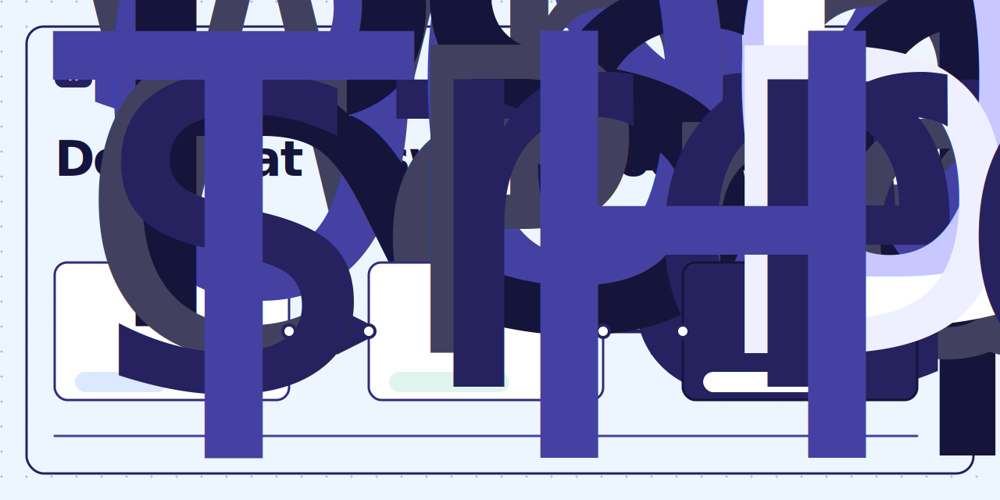

<!-- generated by clean-docs from docs/visuals/source-bound-flow.yml; sha256: d02d8aaf2c2d473dc962b855f1bbff1eae56422204ae7f26f756c5910b40e232 -->
<figure id="visual-source-bound-flow" data-clean-docs-visual="clean-docs.visual.v1">
  

    <picture>
      
    </picture>
    <a href="#visual-source-bound-flow-annotation-source" aria-label="1: Repository sources" style="position: absolute; left: 17%; top: 66%; transform: translate(-50%, -50%); display: inline-flex; align-items: center; justify-content: center; width: 1.75rem; height: 1.75rem; border: 2px solid currentColor; border-radius: 999px; background: Canvas; color: CanvasText; font-weight: 700;">1</a>
    <a href="#visual-source-bound-flow-annotation-bind" aria-label="2: Source bindings" style="position: absolute; left: 49%; top: 66%; transform: translate(-50%, -50%); display: inline-flex; align-items: center; justify-content: center; width: 1.75rem; height: 1.75rem; border: 2px solid currentColor; border-radius: 999px; background: Canvas; color: CanvasText; font-weight: 700;">2</a>
    <a href="#visual-source-bound-flow-annotation-prove" aria-label="3: Deterministic check" style="position: absolute; left: 80%; top: 66%; transform: translate(-50%, -50%); display: inline-flex; align-items: center; justify-content: center; width: 1.75rem; height: 1.75rem; border: 2px solid currentColor; border-radius: 999px; background: Canvas; color: CanvasText; font-weight: 700;">3</a>
  

  <figcaption>clean-docs keeps source facts, prose bindings, and verification connected.</figcaption>
  
<strong>Description:</strong> The flow starts with repository sources, where code and structured files own facts. 
Source bindings connect those facts to specific documentation regions, command output, 
or symbols. A deterministic check then detects drift before merge and can repair, 
reject, or project the declared documentation surface.

  <ol aria-label="Annotation key">
    <li id="visual-source-bound-flow-annotation-source"><strong>Repository sources</strong>: Code and structured repository files own the facts that documentation may claim.</li>
    <li id="visual-source-bound-flow-annotation-bind"><strong>Source bindings</strong>: A declared relationship connects a source fact to its documentation owner.</li>
    <li id="visual-source-bound-flow-annotation-prove"><strong>Deterministic check</strong>: Verification detects drift before merge and can repair, reject, or project declared outputs.</li>
  </ol>
</figure>
